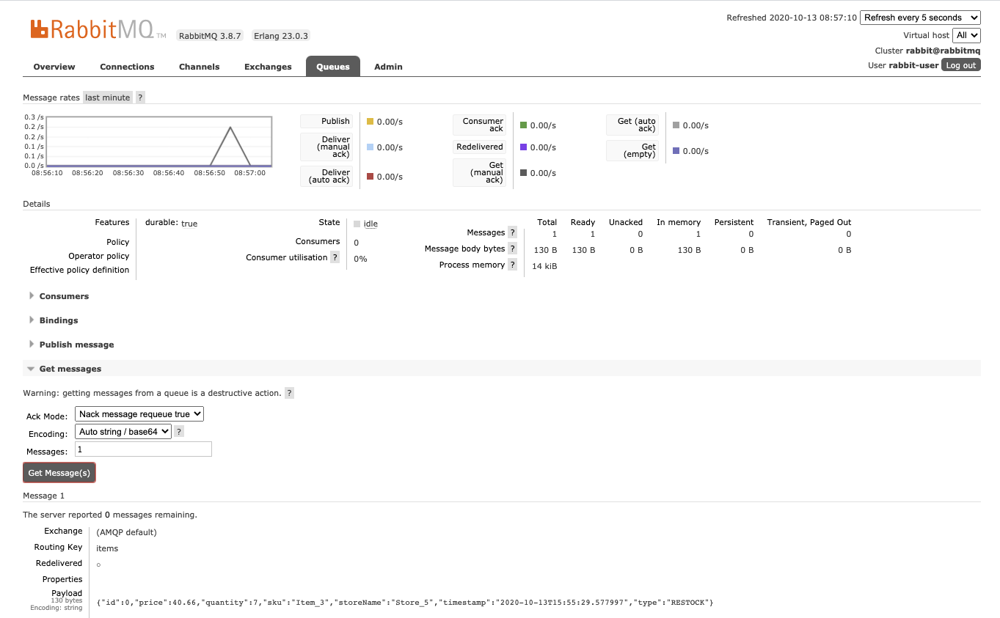
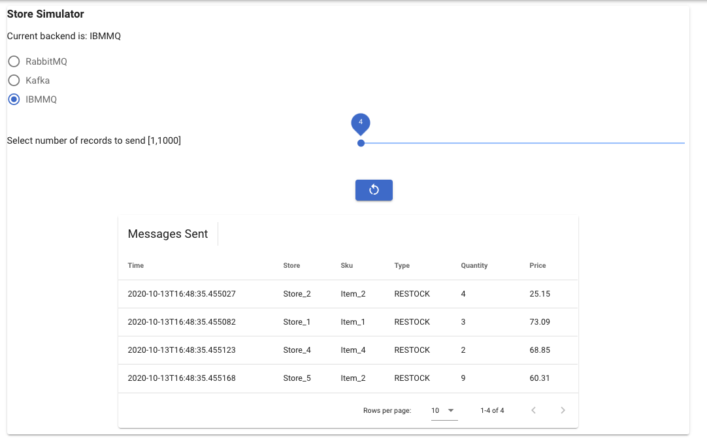
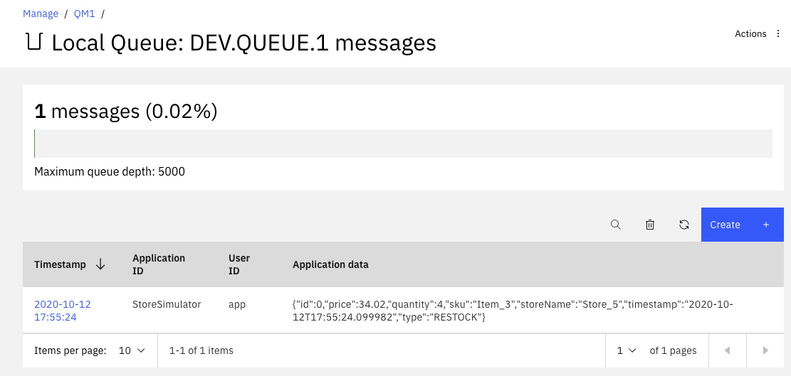
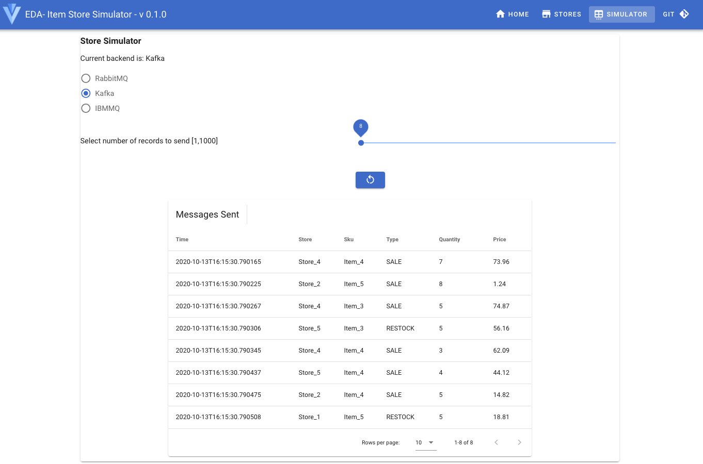
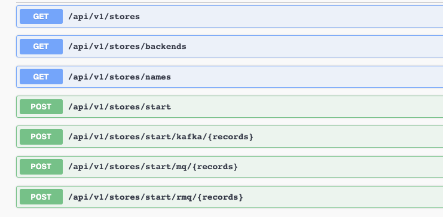

# Store sale event producer simulator

The store sales simulator application aims to demonstrate end to end real time inventory solution. It supports the following capabilities:

* Expose a simple user interface to simulate store selling items which are sent to Queue or Topic. 
* Randomly create item sale events ( includes restocks) and send them to Kafka or RabbitMQ or IBM MQ depending of the application configuration.
* Integrate with external services to query the item inventory and store inventory interactive queries supported by Kafka Streams. (See project: [refarch-eda-item-inventory](https://github.com/ibm-cloud-architecture/refarch-eda-item-inventory))

This implementation is done with Java 11 and [Quarkus](https://quarkus.io) with the AMQP reactive messaging extension to send messages to RabbitMQ, or use the Kafka producer API to send message directly to Kafka, or using JMS to send to IBM MQ. 

Tested 01/06/2021 Quarkus 1.10.5- Rabbit MQ 3.8 on local docker deployment
and Kafka 2.6. IBM MQ 9.2.
Update 04/01/2021: Quarkus 1.13, Add Kustomize for gitops deployment
Update 05/04/2021: Quarkus 1.13.2, Simplify environment folder, add codeql-analysis git workflow.

## Build the application

The docker image for this application is already available on [quay.io registry](https://quay.io/ibmcase/eda-store-simulator).

The buildAll.sh scripts runs Maven packaging and docker build and push. So we need to change this script to push to your own registry.

```shell
./scripts/buildAll.sh 
```

To only build the jar file do:

```sh
./mvnw clean package -Dui.deps -Dui.dev -DskipTests
# Without UI
./mvnw clean package -DskipTests
```

## Run the application locally

The end to end solution is documented in a separate deep dive lab in [this article](https://ibm-cloud-architecture.github.io/refarch-eda/scenarios/realtime-inventory/).

With this repository you can validate sending message to the different backend from a single User interface. All the images are in quay.io or docker hub, but you still need to get the configuration so you need to clone this repository: 

```shell
git clone https://github.com/ibm-cloud-architecture/refarch-eda-store-simulator
```

To run this application locally and assess all the different integration middleware (Kafka, RabbitMQ or MQ) first start all the components:

```shell
cd environment/all
docker-compose up -d 
```

### For Rabbit MQ

Normally the queue is created automatically when running the app, but if you want to create it upfront, the following steps can be done:

* Download `rabbitmqadmin` client from http://localhost:15672/cli/rabbitmqadmin. One version of this script is available in the `environment` folder.

* Declare the queue:

```shell
# under environment folder
./rabbitmqadmin declare queue name=items durable=true -u rabbit-user -p rabbit-pass
```

* List the available queues:

```shell
# under environment folder
./rabbitmqadmin list declara queue name=items durable=false -u rabbit-user -p rabbit-pass
```

See more rabbitmqadmin CLI options [in https://www.rabbitmq.com/management-cli.html](https://www.rabbitmq.com/management-cli.html).

To validate sending message to RabbitMQ do the following steps:

* Go to the App console - simulator tab [http://localhost:8080/#/simulator](http://localhost:8080/#/simulator)
* Select RabbitMQ toggle and then the number of message to send.


* Access Rabbit MQ Console: [http://localhost:15672/#/](http://localhost:15672/#/) user RabbitMQ, to verify messages are in the queue,



### IBM MQ

Using the same approach as above, we can select to send to IBM MQ: use the IBM MQ toggle and send some messages: 



The simulator trace should display similar messages:

```trace
sent to MQ:{"id":0,"price":25.15,"quantity":4,"sku":"Item_2","storeName":"Store_2","timestamp":"2020-10-13T16:48:35.455027","type":"RESTOCK"}

sent to MQ:{"id":1,"price":73.09,"quantity":3,"sku":"Item_1","storeName":"Store_1","timestamp":"2020-10-13T16:48:35.455082","type":"RESTOCK"}

sent to MQ:{"id":2,"price":68.85,"quantity":2,"sku":"Item_4","storeName":"Store_4","timestamp":"2020-10-13T16:48:35.455123","type":"RESTOCK"}

sent to MQ:{"id":3,"price":60.31,"quantity":9,"sku":"Item_2","storeName":"Store_5","timestamp":"2020-10-13T16:48:35.455168","type":"RESTOCK"}
```

And connecting to IBM MQ console [https://localhost:9443](https://localhost:9443/ibmmq/console/#/qmgr/QM1/queue/local/DEV.QUEUE.1/view), using admin/passw0rd credential:



Verify messages are sent.

### Kafka

First be sure the items topic is created, if not running the following command will add it:

```shell
./scripts/createTopics.sh
```

Finally same process applies for Kafka, from the simulator:



Looking at the Simulator trace, you can see the record offset for the message sent.

```trace
sending to items item {"id":5,"price":44.12,"quantity":4,"sku":"Item_4","storeName":"Store_5","timestamp":"2020-10-13T16:15:30.790437","type":"SALE"}

(kafka-producer-network-thread | StoreProducer-1) The offset of the record just sent is: 6
```

Or using the following command to consumer all the messages from the `items` topic:

```shell
docker run -ti --network kafkanet strimzi/kafka:latest-kafka-2.6.0 bash -c "/opt/kafka/bin/kafka-console-consumer.sh --bootstrap-server kafka:9092 --topic items --from-beginning"
```

## Development mode - run locally

When developing the application, you may want to test against only one backend. As the simulator can use three potential environments: kafka with local strimzi, Rabbitmq and IBM MQ, we have setup different docker compose configuration to run those middleware separately.

### RabbitMQ running the application in dev mode

Go under the `environments/rabbitmq` folder and start the two docker containers:

```shell
# under environments/rabbitmq folder
docker-compose docker-compose up
# Start quarkus
./mvnw quarkus:dev
```

Access the API via: [http://localhost:8080/swagger-ui/#/](http://localhost:8080/swagger-ui/#/)

In the Queues page, see the content of the `items` queue, and use the 'get messages' to see the queue content.

The user interface is done in Vue.js under the webapp folder, so it is possible via proxy configuration see ([vue.config.js file](https://github.com/ibm-cloud-architecture/refarch-eda-store-simulator/blob/master/webapp/vue.config.js)) to start `yarn serve` and access the UI connected to the simulator backend.

```shell
# under webapp folder
# Project setup
yarn install
# Compiles and hot-reloads for development
yarn serve
```

Go the [http://localhost:4545/#/](http://localhost:4545/#/) to see the UI. 

Any development under the webapp will be automatically visible in the browser and any change to the Quarkus app are also reflected to make the end to end development very efficient.

### Kafka only (for development)

The compose file is under `environment/kafka` folder.

```shell
# under environments/kafka folder
docker-compose up -d

# Under webapp folder
# Compiles and hot-reloads for development
yarn serve

# under the root folder:
/mvnw quarkus:dev
```

To work on the UI development and test go the [http://localhost:4545/#/](http://localhost:4545/#/) to see the UI. 

To work on the backend API test: []()

### IBM MQ only for development

```shell
# under environments/mq folder
docker-compose  up -d
```

Then same commands as above.

### Packaging the UI and Quarkus app

```shell
# under webapp
yarn build
# under root folder
mvn package
docker build -f src/main/docker/Dockerfile.jvm -t ibmcase/eda-store-simulator .
```

## Implementation approach

The application is using one REST resource for defining the needed APIs: 



The messages sent are defined in the [domain/Item.java](https://github.com/ibm-cloud-architecture/refarch-eda-store-simulator/blob/master/src/main/java/ibm/gse/eda/stores/domain/Item.java) class.

The items sold are part of a simple predefined list of item with SKU defined as

```java
 static transient String[] skus = { "Item_1", "Item_2", "Item_3", "Item_4", "Item_5" };
 
```

The following extensions were added to add metrics, health end points, and OpenShift deployment manifests creation:

```shell
./mvnw quarkus:add-extension -Dextensions="quarkus-smallrye-openapi"
./mvnw quarkus:add-extension -Dextensions="smallrye-health"
./mvnw quarkus:add-extension -Dextensions="smallrye-metrics"
./mvnw quarkus:add-extension -Dextensions="openshift"
```

See the [pom.xml](https://github.com/ibm-cloud-architecture/refarch-eda-store-simulator/blob/master/pom.xml) file detail.

Each integration is done in a separate class under the infrastructure package:

* [Kafka producer with basic API](https://github.com/ibm-cloud-architecture/refarch-eda-store-simulator/blob/master/src/main/java/ibm/gse/eda/stores/infrastructure/kafka/KafkaItemGenerator.java)
* [Rabbit MQ with reactive messaging and AMQP](https://github.com/ibm-cloud-architecture/refarch-eda-store-simulator/blob/master/src/main/java/ibm/gse/eda/stores/infrastructure/rabbitmq/RabbitMQItemGenerator.java)
* [IBM MQ with JMS producer](https://github.com/ibm-cloud-architecture/refarch-eda-store-simulator/blob/master/src/main/java/ibm/gse/eda/stores/infrastructure/mq/MQItemGenerator.java)

## Deploy and run on OpenShift

To package the app as docker images with a build on OpenShift, using the source to image approach, by running the following command:

```shell
./mvnw clean package -Dui.deps -Dui.dev -Dquarkus.container-image.build=true -Dquarkus.container-image.group=ibmcase -Dquarkus.container-image.tag=1.0.0 -Dquarkus.kubernetes.deploy=true -DskipTests
```

If you want to use Kustomize the `src/main/kubernetes` folder includes the necessary yaml manifests to deploy to an OpenShift cluster using `Kustomize`:

```sh
oc login ....
oc new-project test-store-simul
oc apply -k src/main/kubernetes
```
